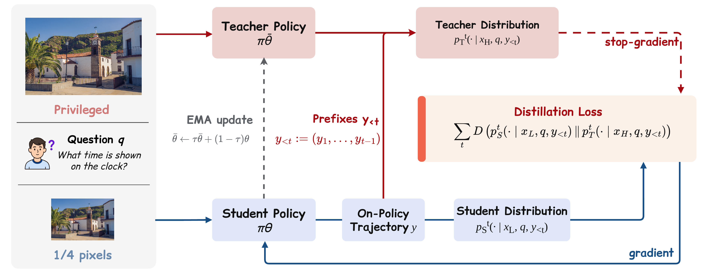

# RP-OPSD

**Resolution-Privileged On-Policy Self-Distillation for Multimodal Large Language Models**

[中文说明](README_zh.md) · **Paper:** [arXiv:2607.24447](https://arxiv.org/abs/2607.24447) · **Dataset:** [Hugging Face](https://huggingface.co/datasets/peppery77/rpopsd/tree/main)

RP-OPSD uses the resolution gap of the same image as privileged information:
a low-resolution student generates on-policy trajectories, while an
original-resolution teacher provides dense token-level supervision. The
method needs only image–question pairs—no external teacher, generated
reasoning traces, or region annotations.

This repository provides the complete Qwen3.5-9B implementation, training,
checkpoint merging, verification, and evaluation pipeline used in the paper.
The training and evaluation source is included directly; no external code
repository is cloned at setup or runtime.

## Method



The student observes images at half width and height (one-quarter of the
original pixels). An EMA teacher observes the original image and supervises
the student's sampled prefixes with a bias-corrected teacher-top-100 reverse
KL objective.

| Setting | Value |
|---|---|
| Student / teacher view | Half resolution / original resolution |
| Rollouts | 8 responses, temperature 1.0 |
| Objective | Bias-corrected teacher-top-100 reverse KL |
| Teacher update | EMA, rate 0.05 |
| Optimization | Batch 96, learning rate 2e-6, 55 steps |
| Hardware used in the paper | 8 × NVIDIA H20 |

## Results

On Qwen3.5-9B, RP-OPSD reaches an average score of **80.43** under
original-resolution evaluation: **+4.16 points / +5.45% relative** over the
base model. It also improves the half-resolution average by **6.09 points**
and provides a **1.78× training speedup** over OPSD (7.83 h vs. 13.93 h).

| Method | V\* | HR-4K | HR-8K | MME-RW EN | MME-RW CN | VisualProbe | MMVP | MMStar | POPE | Avg. |
|---|---:|---:|---:|---:|---:|---:|---:|---:|---:|---:|
| Base | 84.82 | 84.75 | 81.50 | 71.40 | 67.67 | 41.85 | 83.00 | 82.07 | 89.36 | 76.27 |
| SFT | 91.10 | **87.88** | 83.62 | 73.25 | 71.54 | 51.25 | 83.67 | 78.93 | 89.74 | 79.00 |
| GRPO | 88.48 | 84.50 | 81.50 | 75.72 | 71.81 | 50.38 | **84.33** | 80.73 | 89.09 | 78.50 |
| OPSD | 91.10 | 86.88 | 84.25 | **78.12** | **74.43** | 49.97 | 83.00 | 81.40 | 89.08 | 79.80 |
| Vision-OPD | 85.86 | 86.62 | **85.12** | 73.40 | 70.46 | 56.84 | 81.33 | 81.53 | **89.79** | 78.99 |
| **RP-OPSD** | **91.10** | 86.50 | 84.12 | 76.91 | 72.84 | **56.97** | 83.33 | **82.67** | 89.43 | **80.43** |

All scores use original-resolution images. `Avg.` is the unweighted mean of
the nine metrics. The machine-readable reference and evaluation protocol are
available in [expected_metrics.json](expected_metrics.json) and
[provenance/evaluation_protocol.json](provenance/evaluation_protocol.json).

## Cross-Model Distillation

We additionally evaluate resolution-privileged on-policy distillation across
model scales, using a frozen Qwen3.5-9B teacher to train a Qwen3.5-4B student.
The student generates on-policy trajectories from half-resolution images,
while the teacher scores the same trajectories using the original-resolution
images. Only the 4B student is updated.

The distilled 4B model improves on **6 of 7 benchmarks** and raises the
seven-benchmark average from **76.50** to **79.25** (**+2.75 points**).

| Method | V\*Bench | HR-4K | HR-8K | VisualProbe | MMVP | MMStar | POPE | Avg. |
|---|---:|---:|---:|---:|---:|---:|---:|---:|
| Qwen3.5-4B Base | 84.29 | **84.38** | 80.13 | 43.22 | 76.67 | 78.53 | 88.28 | 76.50 |
| **RP-OPSD (9B Teacher → 4B Student)** | **90.58** | 84.25 | **83.00** | **49.90** | **77.67** | **80.07** | **89.31** | **79.25** |

All results use original-resolution images at evaluation time. This
seven-benchmark average is not directly comparable with the nine-benchmark
average in the main table. See the [experiment details](docs/cross_model_distillation.md)
and [machine-readable results](results/cross_model_9b_to_4b.json).

## Training Efficiency

RP-OPSD reduces training time from 13.93 to 7.83 hours (1.78×) while raising
the main-table average from 79.80 to 80.43.

## Reproduction

### Requirements

- Linux and Python 3.12
- Eight NVIDIA GPUs for the reported configuration
- A local Qwen3.5-9B base checkpoint

The pinned environment uses PyTorch 2.10.0, Transformers 5.5.0, vLLM 0.18.0,
and Ray 2.53.0.

> **Dataset:** Dataset4.0 is available on
> [Hugging Face](https://huggingface.co/datasets/peppery77/rpopsd/tree/main).
> This repository includes the corresponding data validation and
> materialization pipeline.

### Quick start

```bash
# 1. Create the pinned environment and install the included RP-OPSD source.
./run.sh prepare-env

# Optional: verify the native source manifest.
./run.sh verify --check-source

# 2. Run a one-step smoke test.
./run.sh smoke --model-path <Qwen3.5-9B> --asset-root <dataset-assets> \
  --output-dir outputs/smoke

# 3. Run the 55-step training recipe.
./run.sh train --model-path <Qwen3.5-9B> --asset-root <dataset-assets> \
  --output-dir outputs/train

# 4. Merge the final FSDP checkpoint.
./run.sh merge --checkpoint-dir outputs/train/checkpoints/global_step_55 \
  --output-dir outputs/merged

# 5. Evaluate the merged model.
./run.sh eval --model-path outputs/merged --judge-model-path <Qwen3.5-9B> \
  --eval-data-dir <evaluation-data> --output-dir outputs/eval --prepare-data
```

Evaluation uses original-resolution images, greedy decoding, disabled
thinking, and seed 42. The canonical suite includes V\*Bench, HR-Bench 4K/8K,
MME-RealWorld EN/CN, VisualProbe, MMVP, MMStar, and POPE.

For an environment-driven end-to-end run, see `./run.sh --help`. To validate
the package and its inputs before training, run `./run.sh verify --help`.

## Repository Structure

| Path | Contents |
|---|---|
| `config/` | Canonical experiment configuration |
| `environment/` | Pinned dependency versions |
| `verl/` | Included training runtime with the RP-OPSD objective |
| `eval/` | Canonical benchmark preparation, inference, judging, and scoring |
| `chat_templates/` | Qwen3.5 multimodal chat template |
| `provenance/` | Source hashes and evaluation protocol |
| `docs/` | Supplementary experiment descriptions |
| `results/` | Machine-readable supplementary results |
| `scripts/` | Environment, training, merging, verification, and evaluation tools |
| `tests/` | Package and release-safety tests |

## Citation

```bibtex
@misc{zhu2026rpopsdresolutionprivilegedonpolicyselfdistillation,
      title={RP-OPSD: Resolution-Privileged On-Policy Self-Distillation for Multimodal Large Language Models},
      author={Qihui Zhu and Yuchen Wang and Zijian Wen and Tao Zhang and Mengjie Zhang and Yang Liu and Shuangwu Chen and Siying Wu and Jian Yang and Xiaofeng Jiang},
      year={2026},
      eprint={2607.24447},
      archivePrefix={arXiv},
      primaryClass={cs.CV},
      url={https://arxiv.org/abs/2607.24447},
}
```

## Acknowledgements

The included training runtime contains code derived from
[Vision-OPD](https://github.com/VisionOPD/Vision-OPD) at commit
[`c2e345f`](https://github.com/VisionOPD/Vision-OPD/commit/c2e345fcab10c806ba83e2ec6e1e246d73e7aba2).

## License

The code is released under the [Apache License 2.0](LICENSE). See
[NOTICE.md](NOTICE.md) for upstream attribution.
